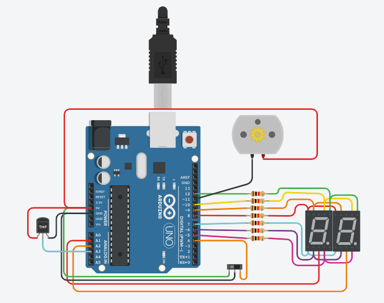

# PARCIAL SPD - ALEJO SECCO

## PARTE 1 
## Contador de 0 a 99 con Display 7 Segmentos y Multiplexación
### Consigna
Diseñar un contador de 0 a 99 utilizando dos displays de 7 segmentos y tres botones para
controlar la cuenta. Debes implementar la técnica de multiplexación para mostrar los dígitos
en los displays. El contador debe comenzar en 0 y debe ser capaz de aumentar o disminuir
su valor en una unidad con los botones.
---

### Descripción
En este parrafo deberan describir que funcion cumple su proyecto. Que solucion esta ofreciendo.
- [LINK TINKERCAD](https://www.tinkercad.com/things/aZlg2pXwmcM-copy-of-copy-of-primera-parte-alejo-secco-1d/editel?sharecode=XqkChwjbE328AVAaIRZkOaZSaZtfEGOYrFCR56Fd9UM).
---
## PARTE 2
## Modificación con Interruptor Deslizante y Números Primos
### Consigna
Modifica el proyecto de la Parte 1 de la siguiente manera:
1. Sustituye uno de los botones por un interruptor deslizante (switch) de dos posiciones.
Dependiendo de la posición del interruptor, el display debe mostrar o bien el contador (como
en la Parte 1) o los números primos en el rango de 0 a 99.
2. Investiga un componente electrónico adicional que podría mejorar este proyecto.
Proporciona una descripción detallada del componente, su función y cómo se podría
integrar en el proyecto.
---

### Descripción
En este parrafo deberan describir que funcion cumple su proyecto. Que solucion esta ofreciendo.
- [LINK TINKERCAD](https://www.tinkercad.com/things/9YKdzDm0ft4-segunda-parte-alejo-secco-1d/editel?sharecode=_l5Oys86G5qd01NMyo-d_k_nrqy1tC6YjSSq9hAh3aQ).
---
## PARTE 3
## Modificación según el Último Número de Documento
### Consigna
Modifica el proyecto de la Parte 2 de la siguiente manera:
1. Considerando el último número de tu número de documento (DNI o documento de
identidad), agrega un componente adicional que afecte el funcionamiento del proyecto.
Describe en detalle qué hace este nuevo componente y cómo se integra en el proyecto.
-Si tu número de documento termina en (0-3) deberás implementar a tu proyecto la
fotoresistencia
-Si tu número de documento termina en (4-6) deberás implementar a tu proyecto la
Fotodiodo.
-Si tu número de documento termina en (7-9) deberás implementar a tu proyecto el
sensor de luz ambiental.
---

### Descripción
En este parrafo deberan describir que funcion cumple su proyecto. Que solucion esta ofreciendo.
- [LINK TINKERCAD](https://www.tinkercad.com/things/eoWokYXtyRT-copy-of-segunda-parte-alejo-secco-1d/editel?sharecode=haLlts5S08DdoSgGPAP2GvX9R8VcqmyBHzSxKZt0WFI).
---
