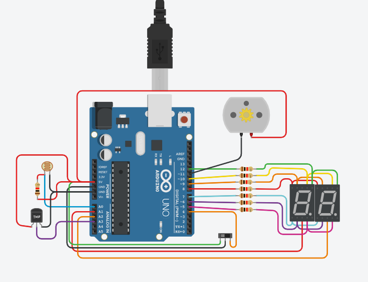

# PARCIAL SPD - ALEJO SECCO

## PARTE 1 
## Contador de 0 a 99 con Display 7 Segmentos y Multiplexación
### Consigna
Diseñar un contador de 0 a 99 utilizando dos displays de 7 segmentos y tres botones para
controlar la cuenta. Debes implementar la técnica de multiplexación para mostrar los dígitos
en los displays. El contador debe comenzar en 0 y debe ser capaz de aumentar o disminuir
su valor en una unidad con los botones.
---

### Descripción
En la parte uno del parcial hice el contador de 0 a 99 usando 2 displays de 7 segmentos. Este contador se controlaba con 3 botones los cuales uno sumaba 1 otro restaba 1 y el otro lo reiniciaba.
- [LINK TINKERCAD](https://www.tinkercad.com/things/aZlg2pXwmcM-copy-of-copy-of-primera-parte-alejo-secco-1d/editel?sharecode=XqkChwjbE328AVAaIRZkOaZSaZtfEGOYrFCR56Fd9UM).
---
## PARTE 2
## Modificación con Interruptor Deslizante y Números Primos
### Consigna
Modifica el proyecto de la Parte 1 de la siguiente manera:
1. Sustituye uno de los botones por un interruptor deslizante (switch) de dos posiciones.
Dependiendo de la posición del interruptor, el display debe mostrar o bien el contador (como
en la Parte 1) o los números primos en el rango de 0 a 99.
2. Investiga un componente electrónico adicional que podría mejorar este proyecto.
Proporciona una descripción detallada del componente, su función y cómo se podría
integrar en el proyecto.
---

### Descripción
En la parte 2 del parcial utilice como base la parte uno a la cual ya no se controla con botones si no que ahora se controla con un switch. Con este switch se puede elegir si el contador funciona como en la parte 1 o si muestra los numeros primos del 0 al 99.
Ademas se le agrego un motor se maneja en relacion con el contador.
- [LINK TINKERCAD](https://www.tinkercad.com/things/9YKdzDm0ft4-segunda-parte-alejo-secco-1d/editel?sharecode=_l5Oys86G5qd01NMyo-d_k_nrqy1tC6YjSSq9hAh3aQ).
---
## PARTE 3
## Modificación según el Último Número de Documento
### Consigna
Modifica el proyecto de la Parte 2 de la siguiente manera:
1. Considerando el último número de tu número de documento (DNI o documento de
identidad), agrega un componente adicional que afecte el funcionamiento del proyecto.
Describe en detalle qué hace este nuevo componente y cómo se integra en el proyecto.
-Si tu número de documento termina en (0-3) deberás implementar a tu proyecto la
fotoresistencia
-Si tu número de documento termina en (4-6) deberás implementar a tu proyecto la
Fotodiodo.
-Si tu número de documento termina en (7-9) deberás implementar a tu proyecto el
sensor de luz ambiental.
---

### Descripción
En la parte 3 del parcial utilice como base la parte 2 a la cual se le agrego una fotoresistencia, la que ahora controlaria la velocidad del contador.
- [LINK TINKERCAD](https://www.tinkercad.com/things/eoWokYXtyRT-copy-of-segunda-parte-alejo-secco-1d/editel?sharecode=haLlts5S08DdoSgGPAP2GvX9R8VcqmyBHzSxKZt0WFI).
---
## PARTE 4
## Modificación según el Último Número de Documento
### Consigna
Modifica el proyecto de la Parte 2 de la siguiente manera:
1. Considerando el último número de tu número de documento (DNI o documento de identidad), modifica una funcionalidad del proyecto.

-Si tu número de documento termina en (0-3) deberás implementar a tu proyecto que el interruptor deslizante de la parte dos tenga la función de encender y apagar el sistema, solo mostrando el contador.

-Si tu número de documento termina en (4-6) deberás implementar a tu proyecto que el motor solo funcione si el interruptor deslizante está del lado de los números primos. 

-Si tu número de documento termina en (7-9) deberás implementar a tu proyecto que no muestre los números primos sino los impares. 

---

### Descripción
En la parte 4 del parcial utilice como base la parte 3 a la cual se le cambie el switch que deja de mostrar los primos y ahora apaga el sistema, sin reiniciar el contador
- [LINK TINKERCAD](https://www.tinkercad.com/things/a96WIHXLCBs-copy-of-tercera-parte-alejo-secco-1d/editel?sharecode=Xa48HzsirzFyrpsEqQIF38EgDuI2P-6_hWyjT65VCro).
---
